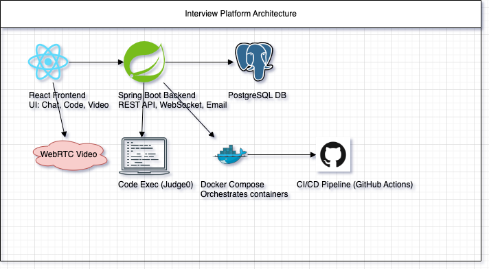
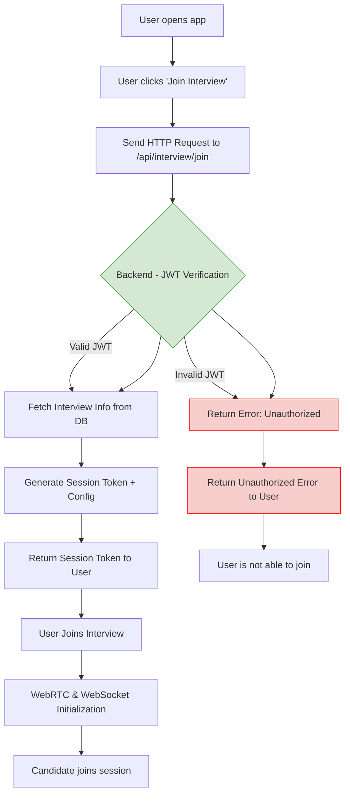

# eValuation

This project is a full-stack interview platform designed to facilitate online technical interviews. It includes a variety of features aimed at enhancing the interview experience for both candidates and interviewers.

### Core Functionalities

* User Authentication (Candidate/Interviewer)
* Video Call (Join/Leave, Toggle Audio/Video)
* Schedule Interview
* Email Notifications
* Chat Box (Real-time)
* Code Editor (Monaco with run option)
* UI Toggles (Open/close chat and code editor)
* Interview Room (Session joining)

## **Architecture Overview**



### Project Workflow

<div style="width: 400px; overflow-x: auto;">



</div>

<!-- 
## **Testing**

* ✅ Unit Tests (Jest for frontend, JUnit for backend)
* ✅ Integration Tests for APIs
* ✅ UI/UX responsiveness and error handling

-->

## 💡 Future Enhancements

* Add **recording functionality** for interviews (advanced)
* Add **code execution API** using services like [Judge0](https://judge0.com/) or Docker-sandbox
* Add **notifications** (Web Push/Toast)
* Support **interview feedback forms**
* Use **OAuth login (Google/LinkedIn)**

## Summary of Tech Requirements

| Module                | Tech Stack                        |
| --------------------- | --------------------------------- |
| Frontend UI           | React.js, TailwindCSS             |
| Video Call            | WebRTC                            |
| Real-Time (Chat etc.) | Socket.IO / WebSocket             |
| Backend API           | Spring Boot, REST, Spring data    |
| DB                    | PostgreSQL/MySQL                  |
| Auth                  | Spring Security + JWT             |
| Email                 | JavaMailSender                    |
| Code Editor           | Monaco Editor                     |
| Scheduler             | Spring Tasks                      |
| Deployment            | AWS                               |

---

## Installation and Start Instructions

### Prerequisites

* **Node.js** (v14 or later)
* **npm**
* **Java** (JDK 17 or later)
* **Maven**
* **MySQL** (or your preferred database)

### Clone the Repository

```bash
git clone https://github.com/ksachin7/CDAC-Project-2025.git
cd CDAC-Project-2025
```

---

#### Build and Run the Backend

Using Maven:

```bash
cd backend
mvn clean install
mvn spring-boot:run
```

---

### Frontend Setup (React)

```bash
cd frontend
npm install
npm run dev
```

This will start the React app on [http://localhost:5173](http://localhost:5173).

See [Contribution Guide](/CONTRIBUTING.md)
